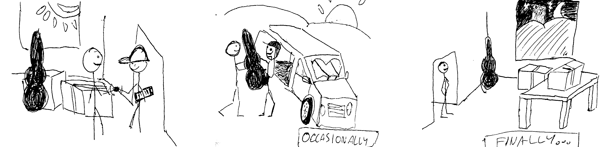
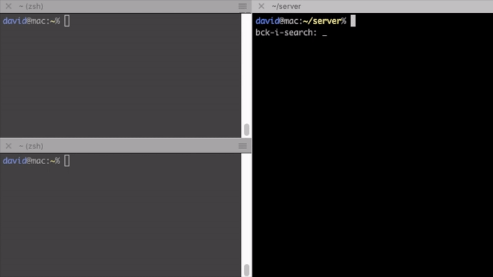
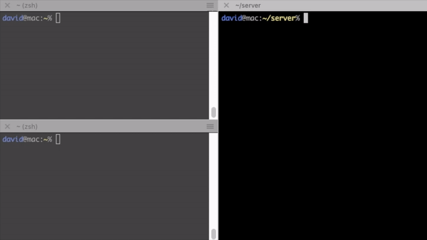
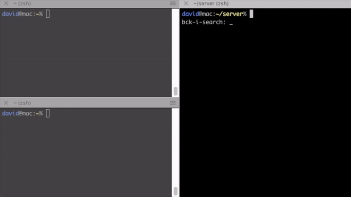

# Concurrency & Parallelism: I/O

With this article we are starting a series of blogposts targeting developers who
want to learn or refresh their knowledge about writing concurrent applications
in general. The series will focus on well-known and widely adopted concurrency
patterns in different programming languages, platforms and runtimes. With this,
we are diverting from our usual articles targeting solely Node.js.

Concurrent code has the bad reputation of being notoriously easy to screw up.
One of the world's most infamous software disasters was caused by a race
condition. A programmer error in the Therac-25 radiation therapy device resulted
in the [death of four people][therac-25]. Data races are not the only problem
though: inefficient locking, starvation, and a myriad of other problems rise up.
I remember from university that even the seemingly trivial, innocent-looking
task of writing a thread-safe singleton proved to be quite challenging because
of these nuances.

No wonder that throughout the decades many concurrency-related patterns emerged
to abstract away the complexity and snip the possibilities of errors. Some have
arisen as a straightforward consequence of the properties of an application
area, like event loops and dispatchers in window managers, GUI toolkits and
browsers; where others succeeded in creating more holistic, or say general
approaches applicable to a wide array of use cases, like Erlang's actor system.

For example, in my experience after a brief learning period, most developers are
able to write highly concurrent, good quality code in Node.js, which is also
free from race conditions. Although nothing is stopping us to create data races,
this is far less frequently happening than in programming languages or platforms
that expose threads, locks and shared memory as their main concurrency
abstraction. I think it's mainly due to the more functional style of creating a
data flow (e.g. promises) instead of imperatively synchronizing (e.g. with
locks) concurrent computations.

However to reason about the "whats and whys", it is best to start from the
ground up, which I think is the OS level. It's the OS that does the hard work of
sheduling our applications and interleaving it with I/O, so it is essential that
we understand the principles. Then we discuss concurrency primitives and patterns
and finally arrive at frameworks.

Let the journey begin!

[therac-25]: https://hackaday.com/2015/10/26/killed-by-a-machine-the-therac-25/

### Contents
  1. [Intro](#intro)
  1. [Processes and threads](#processes-and-threads)
  1. [CPU vs. I/O](#cpu-vs-io)
  1. [I/O flavors: Blocking vs. non-blocking, sync vs. async](#io-flavors-blocking-vs-non-blocking-sync-vs-async)
  1. [TCP server example](#tcp-server-example)

### Intro

Before diving into the OS level details, let's take a second clarifying what is
concurrency exactly. What's the difference between concurrency and parallelism?

Concurrency is much broader, general problem than parallelism. If you have tasks
having inputs and outputs, and you want to schedule them so that they produce
correct results, you are solving a concurrency problem.

Take a look at this diagram:

 </img>

It shows a data flow with input and output dependencies. Here tasks 2, 3, 4 can
run concurrently after 1. There is no specific other between them, so we have
multiple alternatives for running it sequentially. Showing only two of them:

<table style="max-width: 800px; margin: auto; display: block;">
  <tr>
    <td>
      </img>
    </td>
  </tr>
  <tr>
    <td>
    </img>
    </td>
  </tr>
</table>

Alternatively these tasks can run in parallel, e.g. on another processor
core, another processor, or a completely separate computer. On these
diagrams, thread actually means a computation carried out on dedicated processor
core, not an OS thread, as they are not necessarily parallel. How else could
you run a multithreaded webserver with dedicated threads for hundreds of
connections?


</img>

It's not rocket science, but what I wanted to show on these diagrams is that
running concurrent tasks in parallel can reduce the overall computation time.
The results will remain correct as long as the partial order shown on the above
data flow graph is correct. However running if we only have one thread, the
different orders are apparently equivalent, at least regarding the overall time.

If we only only have one processor, why do we even bother with writing
concurrent applications? The processing time will not get shorter, and we add
the overhead of scheduling. As a matter of fact, any modern operating system
will also slice up the concurrent tasks and interleave them so each of the slices
will run for a short time.

There are various reasons for
this.
 - We, human beings like to interact with the computer in real time, e.g.
as I type this text, I want to see it appearing on the screen immediately, at
the same time listening to my favourite tracklist, and getting notifications
about my incoming emails.
- The only Just example that you cannot drag a window while the
movie keeps on playing in it.
 - Not all operations are carried out on the computer's CPU. If you want
 to write to a HDD for example, a lot of time is spent seeking to the position,
 writing the sectors, etc, and the intermittent time can be spent to do
 something else.

These require the operating system kernel to run tasks in an interleaved manner,
referred to as *multi-tasking*. This multi-tasking is achieved by scheduling
processes and threads.

[dataflow]: assets/ex1_dd.png

### Processes and threads

A *process*, quite unsurprisingly, a running instance of a computer program.


> It is what you see in the task manager of your operating system or `top`. --
Captain Obvious

A process consists of allocated memory which holds the program code, its data, a
heap for dynamic memory allocations, and a lot more. However it is not the unit
for multi-tasking in desktop operating systems.

*Thread* is the default unit - *the* task - of CPU usage. Code executed in a
single thread is what we usually refer to as *sequential* or *synchronous*
execution.

Threads are supported by nearly all operating systems (hence the multithreaded
qualifier) and can be created with system calls. They have their own *call
stacks*, *virtual CPU* and (often) *local storage* but share the application's
*heap*, data, codebase and resources (such as file handles) with the other
threads in the same process.

They also serve as the unit of scheduling in the kernel. For
this reason, we call them *kernel threads*, clarifying that they are native to
the operating system and scheduled by the kernel, which distinguishes them from
user-space threads, also called *green threads*, which are scheduled by some
user space scheduler such as a library or VM.

 </img>

Most desktop and server operating system kernels use preemptive schedulers, as
does the Linux, macOS and Windows kernel. We can assume that threads are
preemptively scheduled, distinguishing them from their non-preemptive
(cooperative) counterparts, called *fibers*. This preemptive scheduling is the
reason that a hanging process doesn't stall the whole computer. The hanging time slices are interleaved with other processes' and the OS' code, so the
system as a whole remains responsive.

> **preemption** is the act of temporarily interrupting a task being carried out
by a computer system, without requiring its cooperation, and with the intention
of resuming the task at a later time - *[Wikipedia][preemption]*

Context switching (switching between threads) is done at frequent intervals by
the kernel, creating the illusion that our programs are running in parallel,
whereas in reality they are running concurrently but sequentially in short
slices. Multi-core processors arrived pretty late to commodity: funny that
Intel's [first dual-core processor][pentium-d] was released in 2005, while
multi-tasking OSes had already been in wide use for at least 20 years.

[preemption]: https://en.wikipedia.org/wiki/Preemption_(computing)
[pentium-d]: http://www.pcmag.com/article2/0,2817,1782101,00.asp

### CPU vs. I/O

Programs usually don't only consist of numeric, arithmetic and logic
computations, in fact a lot of times they merely write something to
the file system, do network requests or access peripheries such as the console
or an external device. While the first kind of workload is CPU intensive, the
latter requires performing I/O in the majority of the time.

| CPU bound                   | I/O bound                                     |
|-----------------------------|-----------------------------------------------|
| scientific computation      | reading from / writing to disk                |
| (in-memory) data analysis   | accessing camera, microphone, other devices   |
| simulations                 | reading from / writing to network sockets     |
|                             | reading from stdin                            |

Doing I/O is a kernel space operation, initiated with a system call, so it
results in a privilege context switch. When an I/O operation is requested with a
blocking system call, we are talking about *blocking I/O*. This can deteriorate
concurrency under implementations, concretely those that use *many-to-one
mapping*. This means that all threads in a process share a common kernel thread,
which implies that every thread is blocked when one does blocking I/O (because
of the above mentioned switch to kernel mode). No wonder that modern OSes don't
do this. Instead, they use *one-to-one* mapping, i.e. map a kernel thread to
each user-space thread, allowing another thread to run when one makes a blocking
system call, which means that they are unaffected by the above adverse effect.

### I/O flavors: Blocking vs. non-blocking, sync vs. async

Doing I/O usually consists of two distinct steps:

1. **checking the device**:
 - **blocking**: waiting for the device to be ready, or
 - **non-blocking**: e.g. polling periodically until ready, then


2. **transmitting**:
 - **synchronous**: executing the operation (e.g. read or write) initiated by
 the program, or
 - **asynchronous**: executing the operation as response to an event from the
 kernel (*asynchronous* / *event driven*)

You can mix the two steps in every fashion. I skip delving into to technical
details which I don't possess, instead let me just draw an analogy. Recently I
moved to a new flat, so that's where the analogy comes from. Imagine that you
are moving so you have to pack your things and transfer them to your new
apartment. This is how it is done with different types of I/O:

--------------------------------------------------------------------------------


<p>
  <em>
    <b>Synchronous, blocking I/O</b>: Start to move right away, possibly got
    blocked by traffic on the road. For multiple turns you are required to
    repeat the first two steps.
  </em>
</p>

--------------------------------------------------------------------------------

<p>
  <em>
    <b>Synchronous, non-blocking I/O</b>: Periodically check the road for
    traffic,  only move stuff when clear. Between the checks you can do anything
    else you want, rather than wasting your time on the road being blocked by
    others. For multiple turns you are required to repeat the first three
    steps.
  </em>
</p>

--------------------------------------------------------------------------------

<p>
  <em>
    <b>Asynchronous, non-blocking I/O</b>: Hire a moving company. They will
    ask you periodically if there's anything left to move, then you give them
    some of your belongings. Between their interruptions, you can do whatever
    you want. Finally, they notify you when they are done.
  </em>
</p>
--------------------------------------------------------------------------------

Which model suits you the best depends on your application, the complexity you
dare to tackle, your OS's support, etc.

Synchronous, blocking I/O has the widest support, long established POSIX
interfaces and is the most widely understood and easy to use. It's restricting
in a sense, because you have to rely on thread-based concurrency, which is
sometimes undesirable. (We will see the drawbacks of the thread model in the
next article.)

Asynchronous event-driven I/O on the other hand has more optimization
capabilities exposed to the user-space on the expense of added complexity. It is
intriguing even for advanced programmers, and is also platform-specific, so it
is advisible to use cross platform libraries, such as Boost.Asio (C++), Seastar
(C++), or libuv (C) to hide platform specific details and make programming
easier.

If you want to know more about the details of different I/O models, read
[this detailed article][io]!

[io]: https://www.ibm.com/developerworks/linux/library/l-async/index.html

### Busy-waiting, polling and the event loop

Busy-waiting is the act of repeatedly checking a resource, such as I/O for
availability in a *tight loop*. The absence of the tight loop is what
distinguishes *polling* from busy-waiting. It's better shown than said:


```c
// tight-loop example
while(pthread_mutex_trylock(&my_mutex) == EBUSY) { }
// mutex is unlocked
do_stuff();
```

```c
// polling example
while(pthread_mutex_trylock(&my_mutex) == EBUSY) {
  sleep(POLL_INTERVAL);
}
// mutex is unlocked
do_stuff();
```

The difference between the two code is apparent. The `sleep` function puts the
current thread of execution to sleep, yielding control to the kernel to schedule
something else to run.

It is also obvious that both of them offer a technique of turning
non-blocking code into blocking code, because control won't pass the loop until
the mutex becomes free. This means that `do_stuff` is blocked.

Let's say we have more of these mutexes or any arbitrary I/O device that can be
polled. We can invert control-flow by assigning handlers to be called when the
resource is ready. If we periodically check the resources in the loop, and
execute the associated handlers on completion, we created what is called an
*event loop*.

```c

pending_event_t *pendings;
completed_event_t *completeds;
struct timespec start, end;
size_t completed_ev_size, pending_ev_size, i;
long loop_quantum_us;
long wait_us;

// do while we have pending events that are not yet completed
while (pending_events_size) {
  clock_gettime(CLOCK_MONOTONIC, &start);
  // check whether they are completed already
  for (i = 0; i < pending_events_size; ++i) {
    poll(&pendings, &pending_ev_size, &completeds, &completed_ev_size);
  }
  // handle completed events, the handlers might add more pending events
  for (i = 0; i < completeds_size; ++i) {
    handle(&completeds, &completed_ev_size, &pendings, &pending_ev_size);
  }
  // sleep for a while to avoid busy waiting
  clock_gettime(CLOCK_MONOTONIC, &end);
  wait_us = (end.tv_sec - start.tv_sec) * 1e6 + (end.tv_nsec - start.tv_nsec) / 1e3 - loop_quantum_us;
  if (wait_us > 0) {
    usleep(wait_us * 1e3);
  }
}
```

We will see a more practical explanation later, when we discuss the reactor and
proactor concurrency patterns.


### TCP server example

The following example will illustrate the differences between working with
*synchronous, blocking* and *asynchronous, non-blocking* network I/O. It is a
dead-simple TCP echo server. After the client connects, every line is echoed
back to the socket until the client writes `"bye"`.

#### Single threaded

The [first version][ex-single] uses the standard POSIX procedures of `sys/socket.h`.
The server is single-threaded, it waits until a client connects

```c
/*  Wait for a connection, then accept() it  */
if ((conn_s = accept(list_s, NULL, NULL)) < 0) { /* exit w err */ }
```

then it reads from the socket each line and echoes it back until the client
closes connection or prints the word `"bye"` on a line:

```c
bye = 0;

// read from socket and echo back until client says 'bye'
while (!bye) {
    read_line_from_socket(conn_s, buffer, MAX_LINE - 1);
    if (!strncmp(buffer, "bye\n", MAX_LINE - 1)) bye = 1;
    write_line_to_socket(conn_s, buffer, strlen(buffer));
}

if (close(conn_s) < 0) { /* exit w err */ }
```



As you can see on the gif, this server is **not concurrent** at all, it can
handle only one client at a time. If another client connects, it has to wait
until the preceding one closes connection.

#### Multi-threaded

Introducing concurrency without replacing the synchronous blocking networking
API calls is done with threads. This is shown in the [second version][ex-multi].
The only difference between this and the single-threaded version is that here
we create a thread for each of the connections. A real-life server would use
thread pools of course.

```c
/*  Wait for a connection, then accept() it  */
if ((conn_s = accept(list_s, NULL, NULL)) < 0) { /* exit w err */ }
args = malloc(sizeof(int));
memcpy(args, &conn_s, sizeof(int));
pthread_create(&thrd, NULL, &handle_socket, args);
```



This finally enables us to serve multiple clients at the same time. Hurray!

#### Single threaded, concurrent

Another way to create a concurrent server is to use [libuv][libuv]. It exposes
asynchronous non-blocking I/O calls and an event loop. Although by using it, our
code will be coupled to this library, I still find it better than using obscure,
platform-dependent APIs. The [implementation][ex-libuv] is still quite complex.

Once we initialized our tcp server, we register a listener `handle_socket` for
incoming connections.

```c
uv_listen((uv_stream_t*) &tcp, SOMAXCONN, handle_socket);
```

In that handler we can accept the socket and register a reader for incoming
chunks.

```c
uv_accept(server, (uv_stream_t*) client);
uv_read_start((uv_stream_t*) client, handle_alloc, handle_read);
```

Whenever a chunk is ready and there is data, we register a write handler
`handle_write` that echoes the data back to the socket.

```c
uv_write(write_req, client, &write_ctx->buf, 1, handle_write);
```

Else if the client said bye, or we reached EOF we close the connection.
You can see that to program this way is very tedious and error-prone (I
definitely made some bugs myself, although I copied a large portion of it). Data
created in one function often has to be available somewhere in it's continuation
(a handler created in the function, but asynchronously called later), which
requires manual memory management. I advise you against using libuv directly,
unless you are well acquainted in C programming.



[ex-single]: echo/single.c
[ex-multi]: echo/multi.c
[ex-libuv]: echo/single-uv.c
[libuv]: https://github.com/libuv/libuv

### Next on...

We've seen how to achieve concurrency in the lowest levels of programming. Take
your time to play with the examples. In the next chapter, we continue with some
good ol' concurrency patterns and new ones as well. We will see how to use
futures and promises for threads and continuations and will also talk about the
reactor and proactor design patterns.
